Museum Computer Network -- 2012
===

[Aaron](http://www.aaronland.info) and I did a thing at this year's [Museum Computer Network](http://mcn.edu) conference in Seattle. his slides are on his [website now](http://www.aaronland.info/weblog/2012/11/09/jello/#parallel-tms). I am insanely exhausted and looking forward to #drinkingaboutmuseums sometime soon in NYC! 

Enjoy!

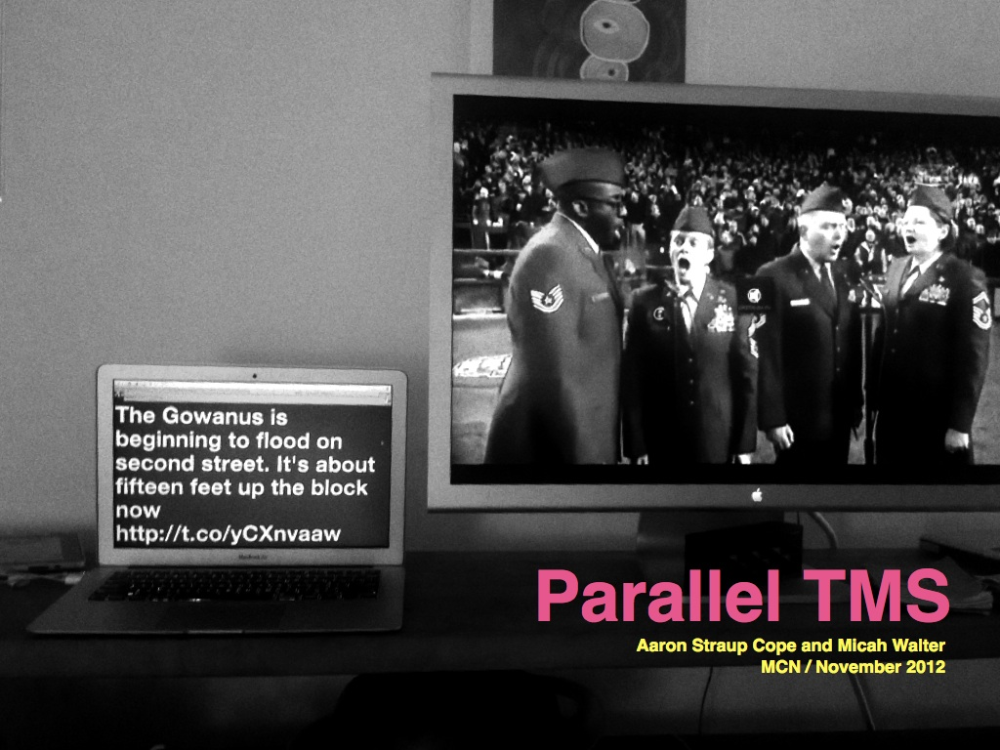

Hi, my name is Micah Walter, and I'm the webmaster at the Cooper-Hewitt, National Design Museum.

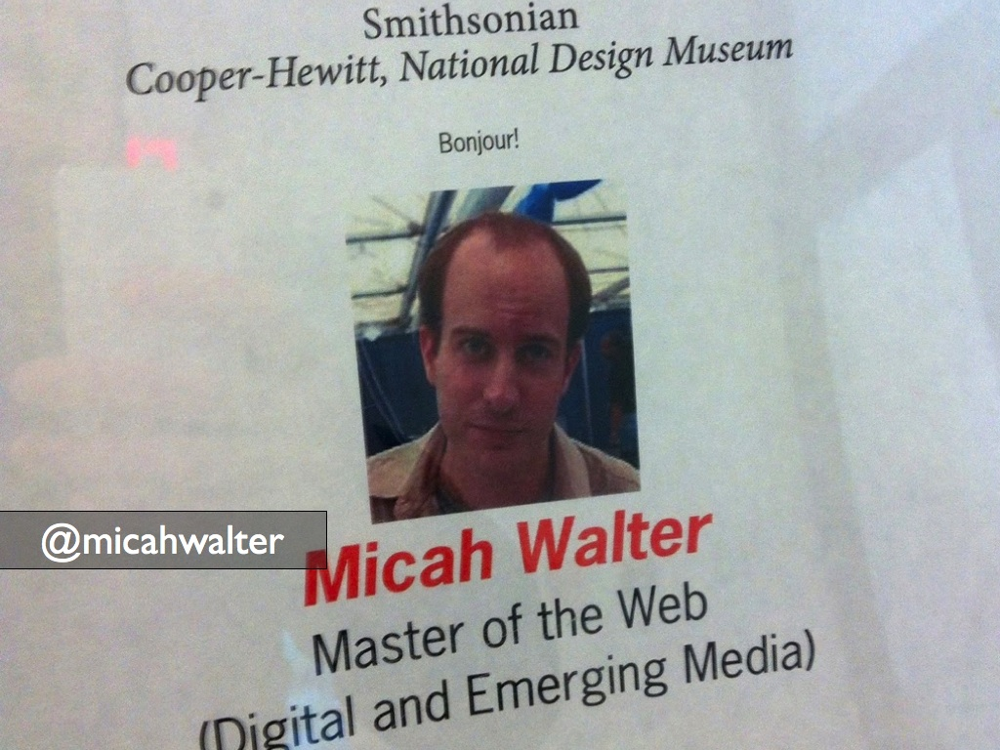

I actually got this fortune cookie about a year ago.  So ... I've been thinking about coming to talk to all of you for some time. Because what I have to say is something I've been thinking about since I started working in museums over two years ago. Before then I had never heard of the Cooper-Hewitt. I wasn't very interested in museums at all, and in fact this job I took as webmaster was originally supposed to be for six weeks. But the more I learned about Cooper-Hewitt, and design, and collections, the more I realized that we had a lot in common.

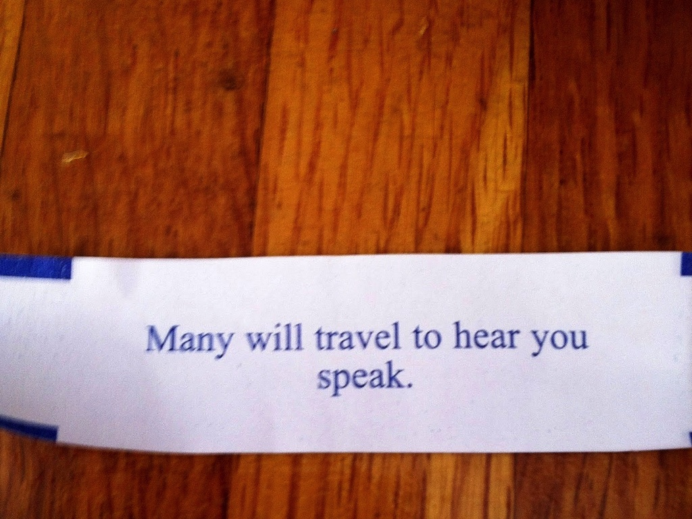

The last time I was home I realized my mother is actually a really amazing collector. She's got lots of these little collections. Birds, snow globes, refrigerator magnets, she just collects what she's in to.

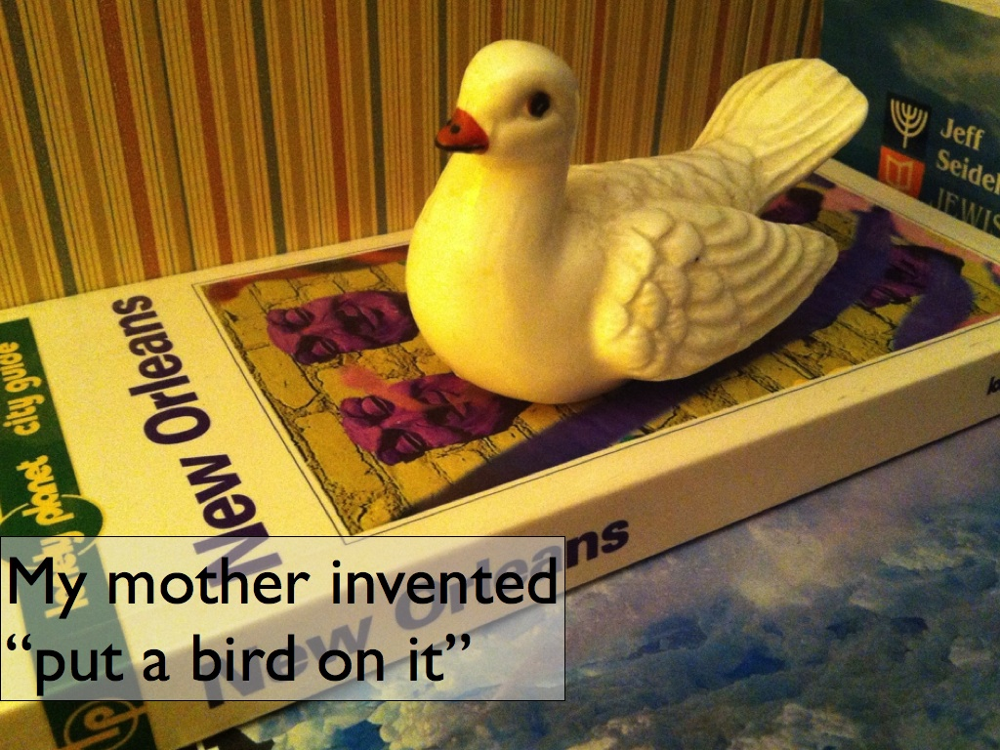

She's sort of like a real life Pinterest board. I was watching her rearrange the living room and I noticed her staring at this end table. She looked at it intensely for about 5 minutes and then she put this bird there, and said "that's it."

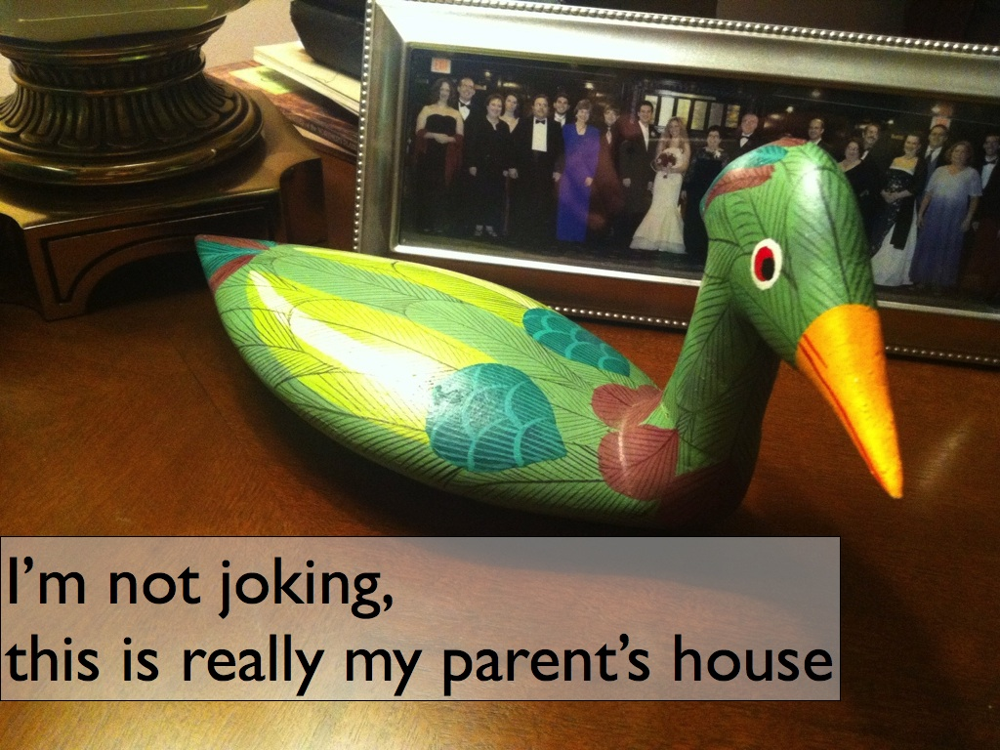

And I thought about that and how she just does this naturally. She's interested in this stuff in a really simplistic way, and its kind of just her taste showing through. And we all do this, all the time. We collect stuff, and we're not quite sure why. And my mother doesn't have a collection management system, or an online collection website, or a Pinterest account, yet. So I've been thinking about how museums, like my mother collect things, and sort of wondering what drives us ( museums ) to collect certain things.

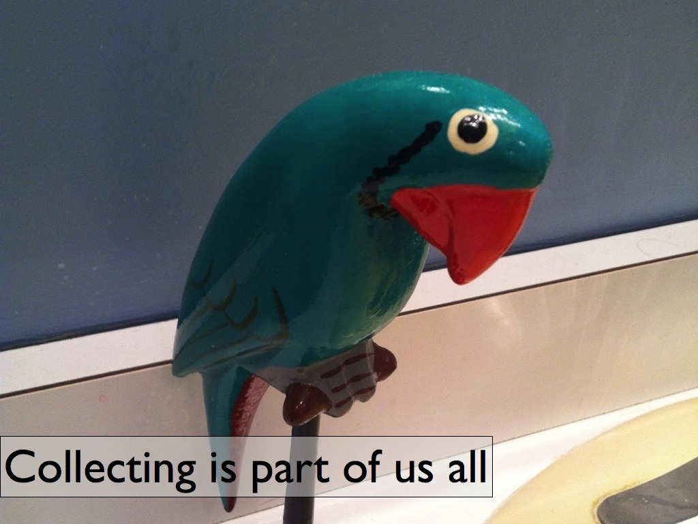

When I first started at Cooper-Hewitt, we had a very small proportion of our collection on the web. I knew we had all this stuff, in databases, files, and brains, throughout the museum, but almost none of it was available beyond the walls of the institution. At the time of my arrival we had an installation of something called eMuseum containing about 1,000 the 225K objects in our collection. 

Eventually I learned that eMuseum was the public facing website of something called TMS. I didn't know what TMS or eMuseum was at the time, but I realized that this thing was our only real pathway for anyone into our collection. It was for all intents and purposes, the only way to "see" our collection. And, I was curious as to "why" we only had 1000 records online.

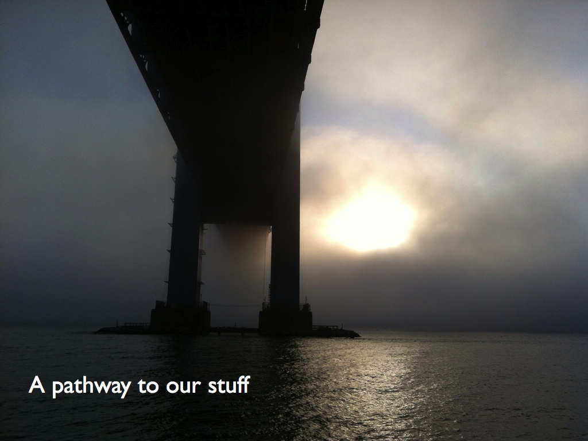

So when Seb Chan started at the Cooper-Hewitt about a year ago he became my new boss and we sat down together on his first day and talked about what we'd like to see happen. It was a long talk. We talked about obvious things like upgrading to Drupal 7, adding a responsive/mobile friendly design to our website, and a bunch of other little things that aren't too interesting. 

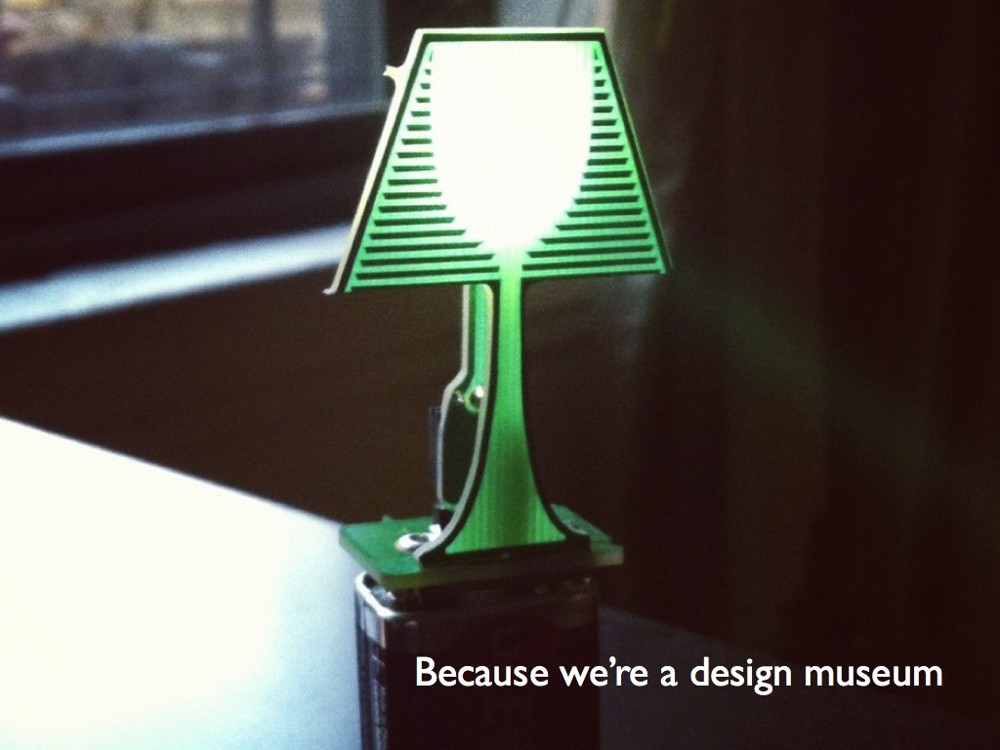

But, the one thing we kept coming back to was the collection, and the fact that we are a "design museum."  We talked about the current state of our collection online and how nobody really had access to it, and therefore weren't able to really get what we were all about, and how eMuseum was sort of a bottle neck in terms of what we could imagine and thus accomplish.

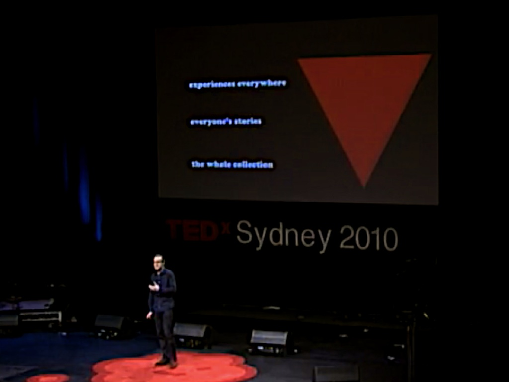

So we started Cooper-Hewitt Labs as a place to talk about what we wanted to talk about. You know, a sort of scratchpad / notebook of what we were working on, but also as a way to put things in motion and allow them to leave the gates before they were even really a thing. To us it was a matter of building momentum.

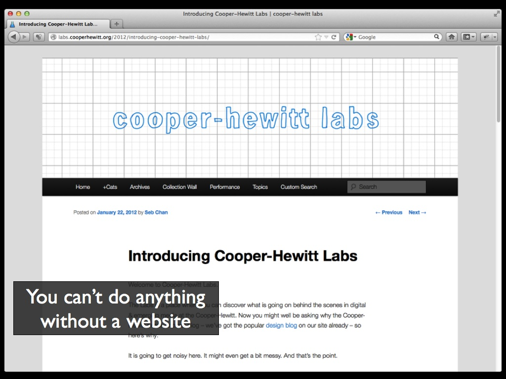

(Before we launched the Labs blog... )

Between our curators and registrars and higher-ups we were eventually able to release about 10,000 records to our public facing website. At that point it was a matter of us verifying that these records contained some minimum criteria to be "web worthy" and kind of good enough for public consumption. Again this confused me. So I started looking at the stuff we had online and asking myself questions like if "this" is good enough to meet that minimum criteria, what do records that don't meet that criteria look like? Was this about responsibility? Or maybe privacy or proprietary-ness of our scholarly work?

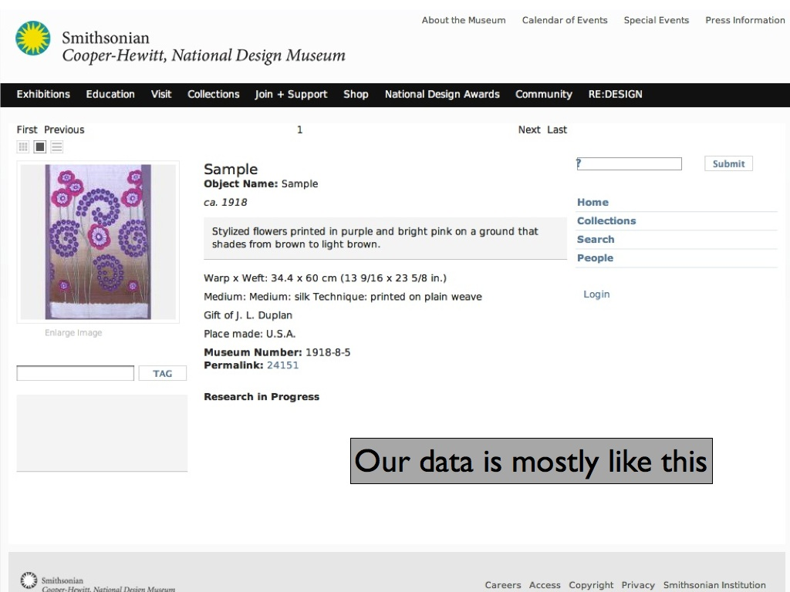

The first step we jumped to was to reduce the minimum criteria for what we can publish to our public website. This was our first thought of what we could do to be able to gain some momentum. We asked our curators and registrars and higher-ups to consider releasing ALL object records that had at least something in the "name" field and a verified credit line. This resulted in eMuseum suddenly going from 10,000 records to over 125,000. This was a huge first step because now...we had some serious stuff online. 

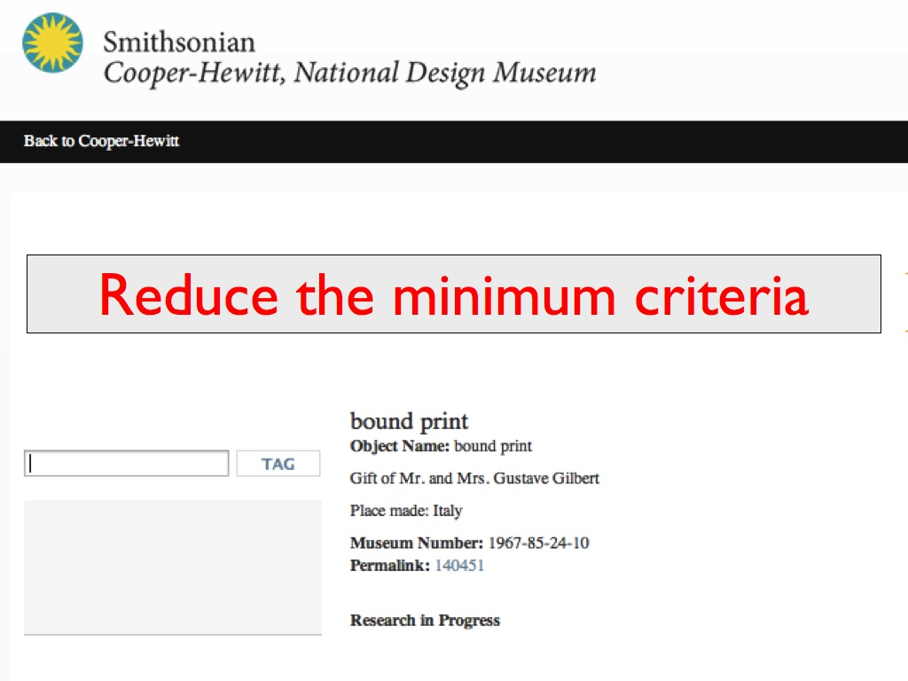

The next step we thought about was simply giving away the meta-data. But what does that even mean? We thought that if we could release the actual meta-data to the public domain we might gain more momentum. It's just meta-data after-all, right? This was unprecedented within the Smithsonian, and it took us all some time to figure out what it really meant, but in the end we were given the chance to go for it. 

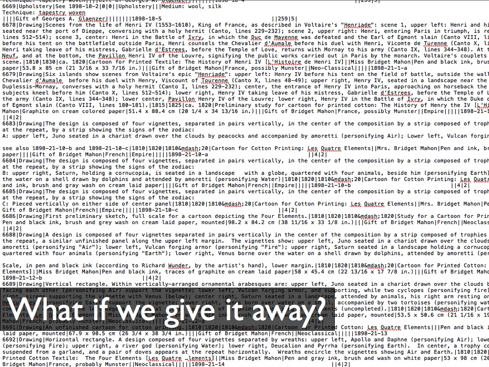

As we prepared to release our data as CC-0 we started to think about "how" this might happen. I mean, physically speaking. We weren't very excited about just making it downloadable as a csv file on our website. We wanted more, and at some point we turned to GitHub as a possibility. Github, originally designed for programmers to track and share their source code, seemed like an interesting place to stare metadata. It had many of the tools we were interested in already in place. People could simply download the data as is, or they could "fork" the repository, keeping track of the "source of truth" and it allowed, at least in theory a possible way to get cleaned up data back in to our own database. Github seemed like a great idea, and after a while we began to explore ways to improve upon what we were able to offer, but the thing we realized was that not only was our metadata pretty bad, we still didn't really have a great way to look at it.

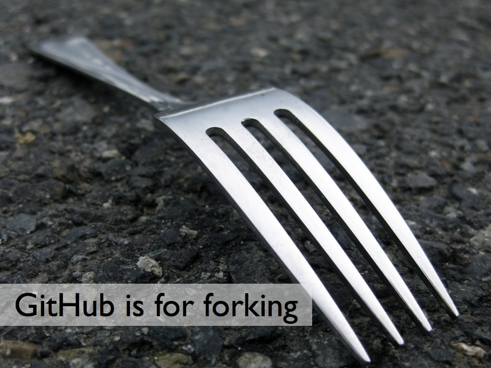

This brought up a number of issues, one of which was theft of our images, and what it meant for our "metadata" to be CC0 while our images were not.

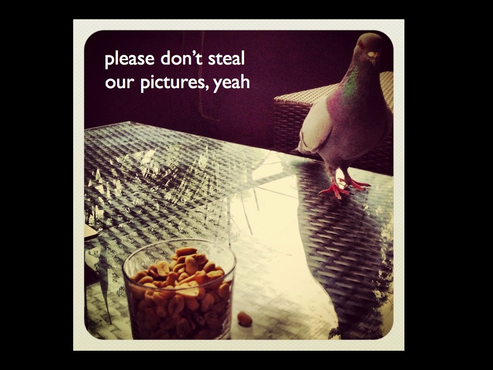

People did stuff with our data

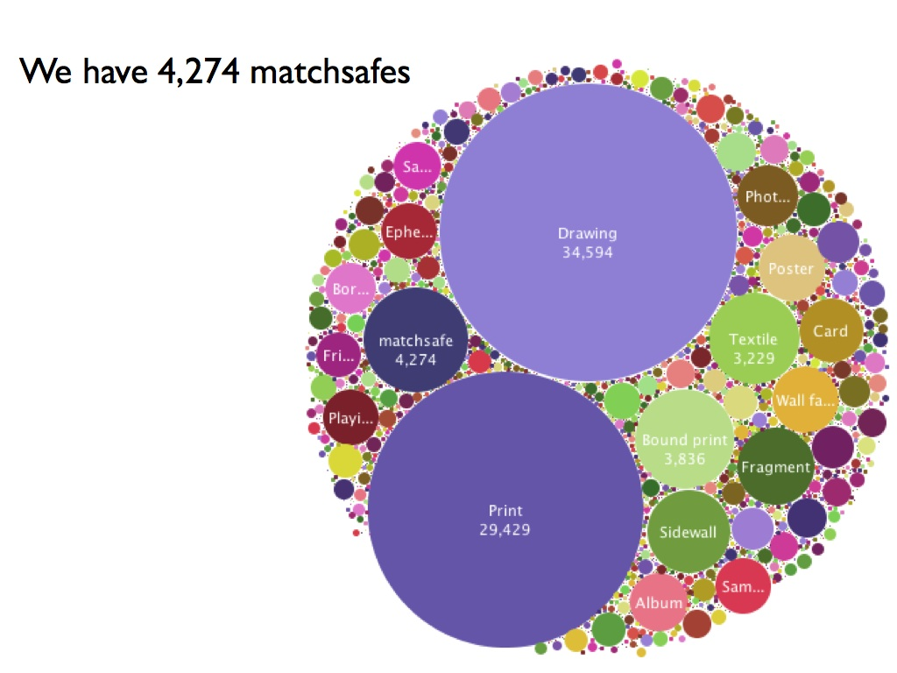

We weren't able to sort of visualize the "shape" of our collection, or understand what our collection was really about. A number of volunteers took a look at our metadata on Github and tried running it through things like Google Refine but it was fairly difficult to deal with. So at some point we thought that the next step would be to use our own metadata, the very same stuff we released to the public to build out a whole new online experience, and in effect do away with eMuseum once and for all.

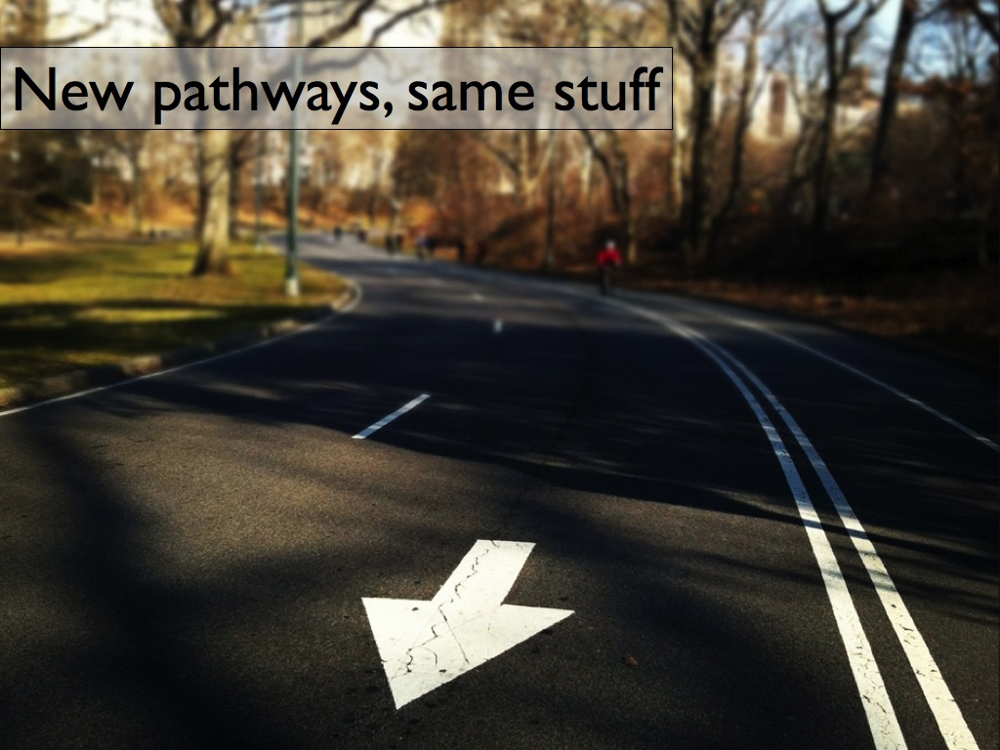
